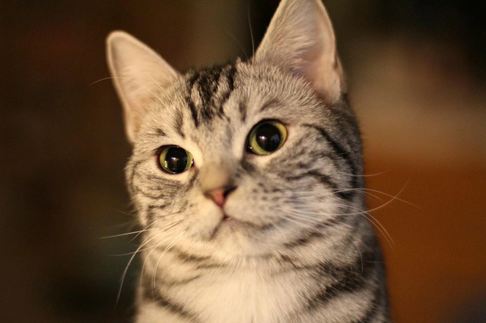

# Изменения в проекте

### 1. Выполнена задача task1
* Vladislav.html
* tanya.html
* README.md
###2.git@github.com:marsel-2007/123.git
###3.
##Всё самое лучшее случается неожиданно.
```html<!DOCTYPE html>
<html lang="en">
<head>
    <meta charset="UTF-8">
    <title>Title</title>
```
